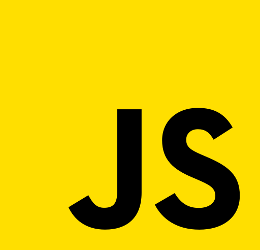
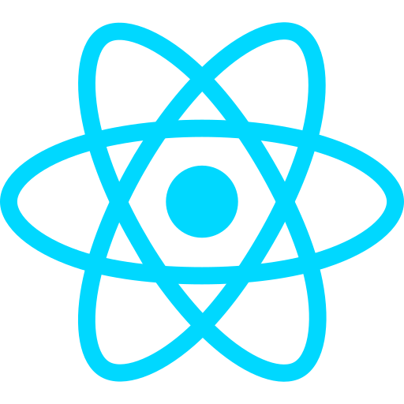
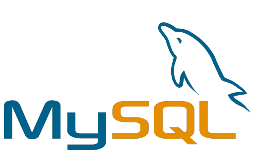
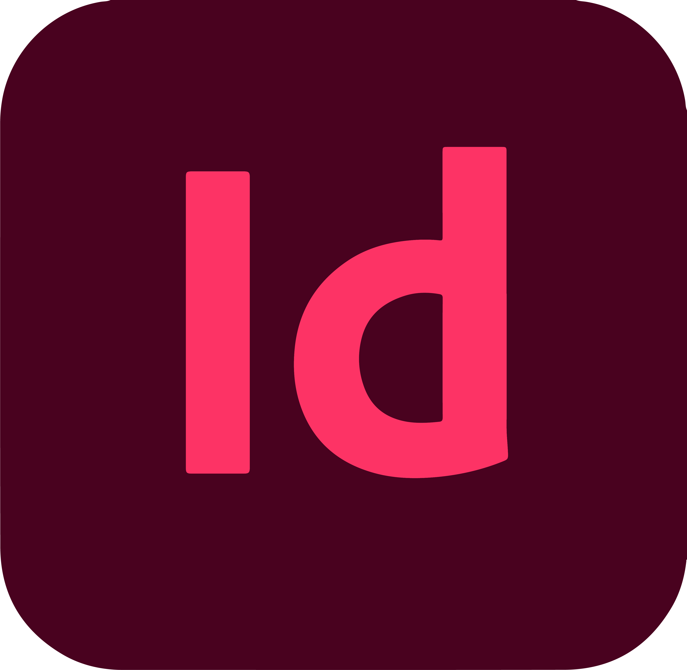
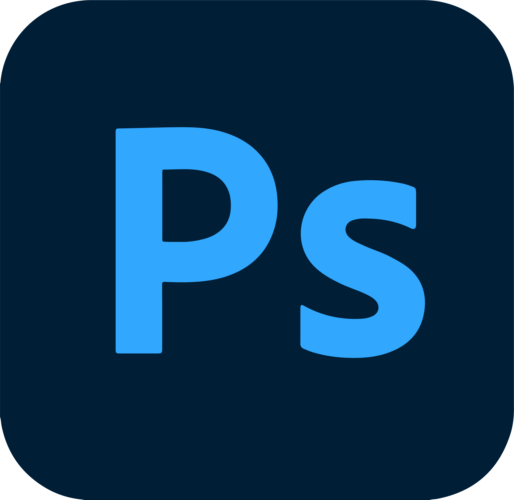

<h1> Hola, I am Yukta Malhotra! </h1>

<h2> Glad to see you here! </h2>

I am a Full Stack Web Developer and Designer. I am a confident and communicatively strong person always looking ahead in the future!

<h2> Talking about personal stuff: </h2>

- 💻 Currently working on Node.js.
- 📖 Currently learning React.js, Data Structures and Algorithm.
- 💡 Interested in IoT and Blockchain Technology.
- 💬 Ask me about anything, I am happy to help.
- ⚡ Fun fact: When I am not working you can find me reading novels and playing piano!

<h2> Languages and Tools: </h2>

 
 
 
 
 
 

 
 
 
 

 

<h2> Connect with me: </h2>

